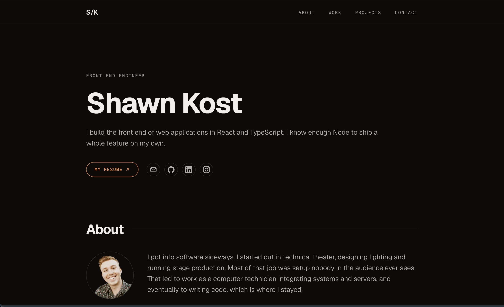

# shawnkost.dev ⚡️

My personal portfolio — built to showcase my work, projects, and experience through a fast, minimal, and content-driven site.

[](https://shawnkost.dev)


---

## About

This repository contains the source for [shawnkost.dev](https://shawnkost.dev), my personal portfolio and home on the web.

It's built with **Astro 7** and **Tailwind CSS v4**, with an emphasis on performance, simplicity, and keeping client-side JavaScript to a minimum.

The site is statically generated and ships without a framework runtime. JavaScript is limited to the interactions that actually need it, plus privacy-friendly analytics through Umami.

## Built With

* **Astro 7** — static site generation and content collections
* **Tailwind CSS v4** — styling and responsive design
* **TypeScript** — typed data and configuration
* **Zod** — build-time content validation
* **astro:assets** — image optimization
* **Umami** — privacy-friendly analytics
* **pnpm** — package management

## Under the Hood

A few of the implementation details behind the site:

**Content-driven architecture**
Projects and work experience are managed through Astro content collections, keeping content separate from presentation.

**Build-time validation**
Content schemas are validated with Zod, so malformed or incomplete content fails during the build rather than making it to production.

**Optimized images**
Images are processed through `astro:assets`, allowing Astro to resize and optimize assets as part of the static build.

**Minimal JavaScript**
The site doesn't ship a client-side framework runtime. JavaScript is reserved for small interactive behavior where it's actually needed.

**Static by default**
Pages are generated ahead of time and served as static assets, keeping the site lightweight and fast.

## Project Structure

```text
src/
├── components/          # Astro components
├── content/
│   ├── experience/      # Work experience
│   └── projects/        # Portfolio projects
├── data/                # Site metadata and skills
├── images/              # Optimized image sources
└── styles/              # Global styles and design tokens
```

## Running Locally

```bash
git clone git@github.com:shawnkost/portfolio.git
cd portfolio

pnpm install
pnpm dev
```

The development server runs at [localhost:4321](http://localhost:4321).

## Commands

```bash
pnpm dev       # Start the development server
pnpm build     # Create a production build
pnpm preview   # Preview the production build
pnpm check     # Type-check and validate content
```
